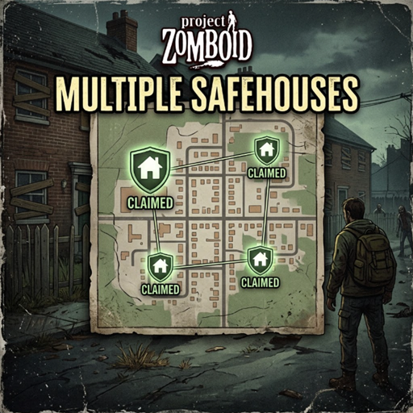

# Multi Safehouses for Project Zomboid

## Reference

- [EmmyLua for PZ with VS Code](https://pzwiki.net/wiki/EmmyLua)
- [Umbrella](https://github.com/PZ-Umbrella/Umbrella)
- [Project Zomboid Java Docs](https://albion.codeberg.page/PZ-JavaDocs)
- [Project Zomboid Lua Docs](https://demiurgequantified.github.io/ProjectZomboidLuaDocs)

## License

This project is licensed under the [MIT License](LICENSE.md).
It allows commercial and non-commercial use, modification, and redistribution,
provided that the original copyright and license notice are retained, and
credit is given to the author.
